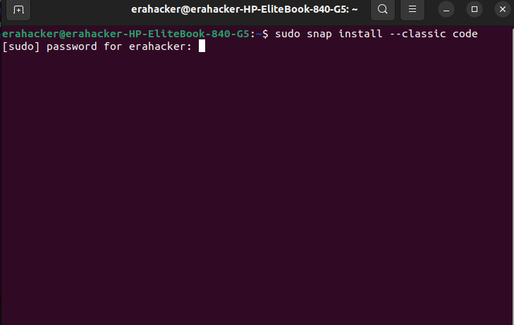

# SE-Assignment-5
Installation and Navigation of Visual Studio Code (VS Code)
 Instructions:
Answer the following questions based on your understanding of the installation and navigation of Visual Studio Code (VS Code). Provide detailed explanations and examples where appropriate.

 Questions:

1. Installation of VS Code:
   - Describe the steps to download and install Visual Studio Code on Windows 11 operating system. Include any prerequisites that might be needed.
 
### Prerequisites:
Ensure you have administrative privileges on your Windows 11 system.
Make sure your system meets the minimum requirements: Windows 11 with x64 architecture.
An active internet connection to download the installation files.
### Steps To install VS code in Windows

#### Download VS Code Installer:
Open your preferred web browser and go to the official Visual Studio Code download page.
Click on the "Download for Windows" button. This will download the VS Code installer for Windows.
#### Run the Installer:
Once the download is complete, locate the downloaded file (it will be named something like VSCodeUserSetup-x64-<version>.exe) in your Downloads folder.
Double-click on the installer file to run it.
#### Install VS Code:
The Visual Studio Code Setup Wizard will open. Click "Next" to proceed.
Read and accept the license agreement, then click "Next."
Choose the destination folder where you want to install VS Code (the default location is usually fine), and click "Next."
###### By default, VS Code is installed under C:\Users\{Username}\AppData\Local\Programs\Microsoft VS Code.
#### Select any additional tasks you want to perform, such as:
Create a desktop icon.
Add "Open with Code" action to the context menu (useful for quickly opening files and folders with VS Code).
Register VS Code as an editor for supported file types.
##### Add to PATH (useful for running VS Code from the command line).
Click "Next" after making your selections.
Click "Install" to begin the installation process.
#### Complete the Installation:
Wait for the installation to complete. This may take a few minutes.
Once the installation is complete, you can choose to launch Visual Studio Code immediately by checking the "Launch Visual Studio Code" box.
Click "Finish" to exit the Setup Wizard.
#### First Launch and Configuration:
If you checked the "Launch Visual Studio Code" box, VS Code will open automatically. Otherwise, you can open it from the Start menu or the desktop shortcut if you created one.
Upon first launch, you might see a welcome screen with options to customize your setup, install extensions, and learn more about VS Code. You can explore these options or close the welcome screen to start using the editor.

## In My Case am Using linux Ubuntu Version
### Steps for installing vs code in ubuntu
### Installing VScode using Snap
#### Run this commands
1. sudo snap install --classic code
in My case I already have Visual studio Installed 

2. First-time Setup:
   - After installing VS Code, what initial configurations and settings should be adjusted for an optimal coding environment? Mention any important settings or extensions.

3. User Interface Overview:
   - Explain the main components of the VS Code user interface. Identify and describe the purpose of the Activity Bar, Side Bar, Editor Group, and Status Bar.

4. Command Palette:
   - What is the Command Palette in VS Code, and how can it be accessed? Provide examples of common tasks that can be performed using the Command Palette.

5. Extensions in VS Code:
   - Discuss the role of extensions in VS Code. How can users find, install, and manage extensions? Provide examples of essential extensions for web development.

6. Integrated Terminal:
   - Describe how to open and use the integrated terminal in VS Code. What are the advantages of using the integrated terminal compared to an external terminal?

7. File and Folder Management:
   - Explain how to create, open, and manage files and folders in VS Code. How can users navigate between different files and directories efficiently?

8. Settings and Preferences:
   - Where can users find and customize settings in VS Code? Provide examples of how to change the theme, font size, and keybindings.

9. Debugging in VS Code:
   - Outline the steps to set up and start debugging a simple program in VS Code. What are some key debugging features available in VS Code?

10. Using Source Control:
    - How can users integrate Git with VS Code for version control? Describe the process of initializing a repository, making commits, and pushing changes to GitHub.

 Submission Guidelines:
- Your answers should be well-structured, concise, and to the point.
- Provide screenshots or step-by-step instructions where applicable.
- Cite any references or sources you use in your answers.
- Submit your completed assignment by 1st July 

