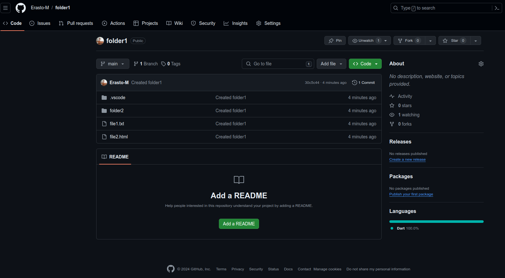

# SE-Assignment-5
Installation and Navigation of Visual Studio Code (VS Code)
 Instructions:
Answer the following questions based on your understanding of the installation and navigation of Visual Studio Code (VS Code). Provide detailed explanations and examples where appropriate.

 Questions:

# Installation of VS Code:
## Describe the steps to download and install Visual Studio Code on Windows 11 operating system. Include any prerequisites that might be needed.
 
### Prerequisites:
- Ensure you have administrative privileges on your Windows 11 system.
- Make sure your system meets the minimum requirements: Windows 11 with x64 architecture.
- An active internet connection to download the installation files.
### Steps To install VS code in Windows

#### Download VS Code Installer:
- Open your preferred web browser and go to the official Visual Studio Code download page.
- Click on the "Download for Windows" button. This will download the VS Code installer for Windows.
#### Run the Installer:
- Once the download is complete, locate the downloaded file (it will be named something like VSCodeUserSetup-x64-<version>.exe) in your Downloads folder.
- Double-click on the installer file to run it.
#### Install VS Code:
- The Visual Studio Code Setup Wizard will open. Click "Next" to proceed.
- Read and accept the license agreement, then click "Next."
- Choose the destination folder where you want to install VS Code (the default location is usually fine), and click "Next."
###### By default, VS Code is installed under C:\Users\{Username}\AppData\Local\Programs\Microsoft VS Code.
#### Select any additional tasks you want to perform, such as:
- Create a desktop icon.
- Add "Open with Code" action to the context menu (useful for quickly opening files and folders with VS Code).
- Register VS Code as an editor for supported file types.
##### Add to PATH (useful for running VS Code from the command line).
- Click "Next" after making your selections.
- Click "Install" to begin the installation process.
#### Complete the Installation:
- Wait for the installation to complete. This may take a few minutes.
- Once the installation is complete, you can choose to launch Visual Studio Code immediately by checking the "Launch Visual Studio Code" box.
- Click "Finish" to exit the Setup Wizard.
#### First Launch and Configuration:
- If you checked the "Launch Visual Studio Code" box, VS Code will open automatically. Otherwise, you can open it from the Start menu or the desktop shortcut if you created one.
- Upon first launch, you might see a welcome screen with options to customize your setup, install extensions, and learn more about VS Code. You can explore these options or close the welcome screen to start using the editor.

## In My Case am Using linux Ubuntu Version
### Steps for installing vs code in ubuntu
### Installing VScode using Snap
1. Open terminal
#### Run this commands
2. sudo snap install --classic code
3. in My case I already have Visual studio Installed 

### Installing VS Code using APT
1. Open terminal 
2. Install dependencies using this commands 
-  sudo apt update
-  sudo apt install software-properties-common apt-transport-https wget
3. Import the microsoft GPG key
- wget -qO- https://packages.microsoft.com/keys/microsoft.asc | gpg --dearmor | sudo tee /usr/share/keyrings/microsoft-archive-keyring.gpg > /dev/null
4. Enable the Visual Studio Code Repository:
- sudo sh -c 'echo "deb [arch=amd64 signed-by=/usr/share/keyrings/microsoft-archive-keyring.gpg] https://packages.microsoft.com/repos/code stable main" > /etc/apt/sources.list.d/vscode.list'

5. Update the Package List:
- sudo apt update
6. install Visual studio code 
- sudo apt install code
7. launch visual studio code 
- code 

# First-time Setup:
## After installing VS Code, what initial configurations and settings should be adjusted for an optimal coding environment? Mention any important settings or extensions.
## Theme and Appearance
### Choose a Theme:
- Go to File > Preferences > Color Theme or press Ctrl+K Ctrl+T and select a theme that suits your preference. Popular choices include "Dark+ (default dark)" and "Light+ (default light)."
## Settings Sync
### Enable Settings Sync:
- Go to File > Preferences > Settings Sync and sign in with your GitHub or Microsoft account. This syncs your settings, extensions, and themes across multiple devices.
## Essential Extensions
- Install Recommended Extensions:,
- Python: For Python development.,
- ESLint: For JavaScript and TypeScript linting.,
- Prettier: Code formatter for consistent style.,
- GitLens: Enhances Git capabilities within VS Code.,
- Debugger for Chrome: Debugging JavaScript code in Chrome.

## Editor Settings 
### Adjust Editor Settings:
- Go to File > Preferences > Settings or press Ctrl+, and adjust the following settings for a better coding experience:
#### Font Size: Adjust for readability.
- "editor.fontSize": 14
#### Tab Size: Set to your preference, often 2 or 4 spaces.
- "editor.tabSize": 2
#### Auto Save: Enable auto-saving of files.
- "files.autoSave": "afterDelay",
- "files.autoSaveDelay": 1000
#### Word Wrap: Enable word wrapping for long lines.
- "editor.wordWrap": "on"
#### Linting and Formatting on Save: Enable ESLint and Prettier to run on file save.
- "editor.codeActionsOnSave": {
    "source.fixAll.eslint": true
},
- "editor.formatOnSave": true

## Terminal Configuration
### Integrated Terminal:
- Open the integrated terminal with Ctrl+` .
- Configure the default shell to your preference (bash, zsh, PowerShell, etc.):
- "terminal.integrated.shell.linux": "/bin/bash"
## Version Control
### Git Configuration:
- configure Git with your user information., 
- git config --global user.name "Your Name"
- git config --global user.email "your.email@example.com"

# User Interface Overview:
## - Explain the main components of the VS Code user interface. Identify and describe the purpose of the Activity Bar, Side Bar, Editor Group, and Status Bar.
Visual Studio Code (VS Code) has a user-friendly interface designed to provide a smooth coding experience. Here are the main components of the VS Code user interface:

1. Activity Bar
- Location: Left side of the screen.
- Purpose: The Activity Bar provides access to different views and functionalities. It contains icons for various activities like Explorer, Search, Source    Control, Run and Debug, and Extensions.
- Components:
Explorer (File Icon): View and manage your project's files and folders.
Search (Magnifying Glass Icon): Search text and replace within your project.
Source Control (Branch Icon): Manage version control with Git and other SCM providers.
Run and Debug (Play Icon): Start and manage debugging sessions.
Extensions (Square Icon): Browse and install VS Code extensions to enhance functionality.

2. Side Bar
- Location: Right next to the Activity Bar on the left side.
- Purpose: The Side Bar displays the contents relevant to the selected activity from the Activity Bar.
- Components:
Explorer: Shows the file and folder structure of your workspace.
Search: Displays search results and options.
Source Control: Displays version control information and options.
Run and Debug: Shows debugging configurations and status.
Extensions: Lists installed extensions and recommendations.

3. Editor Group 
- Location: Central area of the screen.
- Purpose: The Editor Group is where you open and edit files. VS Code supports multiple editor groups for split-view editing.
- Components:
Tabs: Each open file is represented by a tab at the top of the editor group.
Split Editors: You can split the editor into multiple groups by dragging tabs or using commands (Ctrl+\ to split, Ctrl+1, Ctrl+2, etc., to focus).
Minimap: A small overview of your file for quick navigation, shown on the right edge of the editor.

4. Status Bar
Location: Bottom of the screen.
Purpose: The Status Bar provides information about the current file and workspace, as well as shortcuts to various settings and functions.
Components:
File Information: Displays details like file type, line number, and encoding.
Git Branch: Shows the current Git branch and status.
Errors and Warnings: Displays the number of errors and warnings in the current file.
Language Mode: Indicates the programming language of the current file; clicking it allows you to change the language mode.
Line Ending and Encoding: Shows the current line ending (LF/CRLF) and file encoding.
Quick Actions: Provides access to common actions like selecting a workspace or opening settings.

# Command Palette:
## What is the Command Palette in VS Code, and how can it be accessed? Provide examples of common tasks that can be performed using the Command Palette.
The Command Palette in Visual Studio Code (VS Code) is a powerful tool that provides quick access to a wide range of commands and features. It allows users to perform tasks efficiently without having to navigate through menus.

### Accessing the Command Palette
Keyboard Shortcut: Press Ctrl+Shift+P (Windows/Linux) or Cmd+Shift+P (Mac).

Menu Access: Alternatively, you can open the Command Palette by selecting View > Command Palette from the menu bar.

### Common Tasks Using the Command Palette
The Command Palette can be used for a variety of tasks. Here are some examples:
1. Opening Files and Folders
Open File:
Type >Open File and select the file you want to open.
Open Folder:
Type >Open Folder and navigate to the desired folder.
2. Running Commands
Format Document:
Type >Format Document to format the current file based on your settings or installed formatter extensions.
Toggle Terminal:
Type >Toggle Integrated Terminal to open or close the integrated terminal.
3. Navigating and Searching
Go to Line:
Type >Go to Line and enter the line number you want to navigate to.
Quick Open:
Type Ctrl+P (part of the Command Palette) to quickly open files by name.
4. Managing Extensions
Install Extensions:
Type >Extensions: Install Extensions to browse and install new extensions.
Disable Extensions:
Type >Extensions: Disable to disable a specific extension.

5. Customizing Settings
Open Settings:
Type >Preferences: Open Settings to open the settings editor.
Change Theme:
Type >Preferences: Color Theme to change the color theme of the editor.
6. Version Control
Commit Changes:
Type >Git: Commit to commit staged changes.
Pull from Repository:
Type >Git: Pull to pull the latest changes from the remote repository.
7. Debugging
Start Debugging:
Type >Debug: Start Debugging to begin a debugging session.
Add Configuration:
Type >Debug: Open launch.json to add or edit debug configurations.
8. Refactoring and Code Actions
Rename Symbol:
Type >Rename Symbol to rename all instances of a symbol in the current file.
Quick Fix:
Type >Quick Fix to apply code fixes suggested by VS Code or installed extensions.

# Extensions in VS Code:
##  Discuss the role of extensions in VS Code. How can users find, install, and manage extensions? Provide examples of essential extensions for web development.
Extensions play a crucial role in enhancing the functionality of Visual Studio Code (VS Code). They allow users to customize their coding environment, add new features, and support additional languages, frameworks, and tools.

## Finding, Installing, and Managing Extensions
### Finding Extensions
Click on the Extensions icon in the Activity Bar on the side of the window to open the Extensions view.
Use the search bar to find specific extensions or browse through categories.

### Installing Extensions
1. From the Extensions View:
Search for the desired extension.
Click the Install button next to the extension.

2. From the Command Palette:
Open the Command Palette (Ctrl+Shift+P or Cmd+Shift+P).
Type >Extensions: Install Extensions and press Enter.
Search for the desired extension and install it.
### Managing Extensions
1. Enable/Disable Extensions:
In the Extensions view, find the installed extension and click on the gear icon.
Select Enable or Disable from the dropdown menu.

2. Update Extensions:
Extensions are usually updated automatically, but you can manually update them by clicking on the Update button if available.
3. Uninstall Extensions:
Click the gear icon next to the extension and select Uninstall.

## Essential Extensions for web development
Here are some essential extensions for web development in VS Code:
1. HTML, CSS, and JavaScript
- HTML CSS Support:
Enhances CSS class and ID completion for HTML.

- CSS Peek:
Allows you to quickly jump to CSS definitions from your HTML files.

2. JavaScript/TypeScript
- ESLint:
Integrates ESLint into VS Code for identifying and fixing JavaScript code issues.

- Prettier - Code Formatter:
Formats your code consistently according to a set of rules.

# Integrated Terminal:
##  Describe how to open and use the integrated terminal in VS Code. What are the advantages of using the integrated terminal compared to an external terminal?
### Opening the Integrated Terminal
Menu Access: Go to View > Terminal.

### Using the Integrated Terminal
Create Multiple Terminals: Click the + icon or use Ctrl+Shift+ (to split terminal).
Switch Between Terminals: Use the dropdown menu in the terminal panel.
Run Commands: Type commands as you would in an external terminal.

Advantages
Convenience: No need to switch between editor and external terminal.
Contextual Awareness: Opens in the project's root directory.
Consistency: Shared environment settings with the editor.
Workspace Integration: Seamlessly integrates with VS Code features.
Multi-Terminal Management: Easily manage and switch between terminals within the editor.

# File and Folder Management:
##  Explain how to create, open, and manage files and folders in VS Code. How can users navigate between different files and directories efficiently?
Create a New folder and open it

Create New File:
Use the Explorer view or Command Palette (Ctrl+Shift+P > >New File).
Open Files:

Click on files in the Explorer view or use Ctrl+P to search and open files by name.
Manage Folders:
Right-click in the Explorer view to create new folders, delete files, and perform other file operations.
Navigate Efficiently:
Creating folder 2 inside folder 1

Use keyboard shortcuts like Ctrl+P for quick file search, Ctrl+Tab to switch between recently opened files, and Ctrl+\ to split editor views.
Explorer View:
Collapse and expand folders in the Explorer view to locate and manage files efficiently.
collapsing the files in folder 2

#  Settings and Preferences:
##  Where can users find and customize settings in VS Code? Provide examples of how to change the theme, font size, and keybindings.
1. Access Settings:
Open File > Preferences > Settings or press Ctrl+, to access VS Code settings.

Can also use the settings icon in the Status bar

2. Change Theme:
Navigate to Color Theme under Workbench settings to choose a new theme.

3. Adjust Font Size:
Search for Font Size and adjust the value as needed to change the editor's font size.

4. Customize Keybindings:
Use Keyboard Shortcuts to modify or add new keybindings for various commands and actions.

# Debugging in VS Code:
## Outline the steps to set up and start debugging a simple program in VS Code. What are some key debugging features available in VS Code?
Setting Up and Starting Debugging
1. Configure Launch.json:
Open VS Code and navigate to the Debug view (Ctrl+Shift+D).
Click on the gear icon (create a launch.json file) and select a debug configuration for your programming language (e.g., Node.js, Python, dart, etc.).
configuring launch.json for dart

2. Set Breakpoints:
Open the file you want to debug.
Click in the gutter next to the line numbers to set breakpoints where you want the debugger to pause execution.
Adding breakpoint for file.dart

3. Start Debugging:
Press F5 or click the green play button next to the debug configuration in the Debug view to start debugging.
The debugger will pause at your breakpoints, allowing you to inspect variables, step through code, and analyze program flow.

### Key Debugging Features Available in VScode
1. Variable Inspection:
View the values of variables in the Debug view or hover over them in the editor.
2. Call Stack:
See the current call stack and navigate through function calls.
3. Watch Expressions:
Monitor specific variables or expressions to track their values during debugging.
4. Step Controls:
Use F10 to step over, F11 to step into, and Shift+F11 to step out of functions.
5. Debug Console:
Access the Debug Console to execute arbitrary commands or evaluate expressions in the context of your program.
6. Breakpoint Management:
Disable, enable, or remove breakpoints dynamically during debugging sessions.

#  Using Source Control:
## How can users integrate Git with VS Code for version control? Describe the process of initializing a repository, making commits, and pushing changes to GitHub.
Visual Studio Code (VS Code) provides powerful tools to integrate Git for version control directly within the editor, making it convenient to manage code changes and collaborate with others. Here’s a brief overview of how to utilize Git with VS Code:
1. Initialize a Repository:
Open your project folder in VS Code.
Click on the Source Control icon in the Activity Bar (Ctrl+Shift+G).
Click Initialize Repository to create a new Git repository in the current workspace.
or run this command in the Terminal 

2. Make Commits:
After making changes to your files, stage them by clicking the + icon next to each file in the Source Control view to mark them for commit.
Enter a descriptive commit message in the text box at the top of the view.
Press Ctrl+Enter or click the checkmark icon to commit your changes locally.
or run this commands in the terminal 

3. Push Changes to GitHub:
Create a repository in github

Ensure your local repository is connected to a remote repository on GitHub.
In the Source Control view, click the ellipsis (...) next to your repository name.
Select Push to push your committed changes to the corresponding branch on GitHub.
or run this commands in the terminal 

4. confirm your local repository has been pushed
